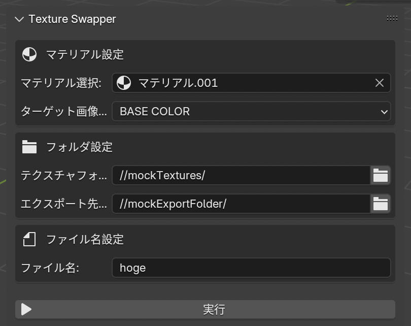

# テクスチャ自動入れ替えBlenderアドオン

## 概要

Blenderで**特定のマテリアル**に設定された**特定の画像テクスチャ**を、指定したフォルダ内の画像で自動的に入れ替えてエクスポートするアドオン

**親愛なる先輩への誕生日プレゼント**



---

## インストール方法

1. このリポジトリをダウンロードして解凍
2. 解凍したフォルダ内の"texture-swapper.zip"ファイルを探す
   - ZIPファイルがある場合:
     1. Blenderの設定画面を開いて「アドオン」タブを選択
     2. 「インストール」ボタンをクリックしてZIPファイルを選択
   - ZIPファイルがない場合:
     1. "texture-swapper"フォルダを圧縮してZIPファイルを作成
     2. Blenderの設定画面を開いて「アドオン」タブを選択
     3. 「インストール」ボタンをクリックして作ったZIPファイルを選択
3. アドオン一覧から「Texture Swapper」を探してチェックボックスをオン

## 使用手順

1. **特定のマテリアル**を選択
2. 選択したマテリアルに紐づく**画像ノード**を選択
3. **入れ替えたい画像テクスチャ群**が格納されたフォルダを指定
4. **モデルエクスポート先**のフォルダを指定
5. **ファイル名**を入力(例："hoge"と入力すると"hoge_{画像ファイル名}"がモデルファイル名)
6. エクスポートしたいオブジェクトを選択
7. 「実行」ボタンをクリック
8. 指定したフォルダを確認

---

## アドオン内部ファイル構成

```text
texture-swapper/
├── __init__.py     # アドオンのメインファイル。Blenderが最初に読み込む。
├── properties.py   # UIと紐づいたり参照するためのプロパティを定義するファイル。
├── operator.py     # 実行処理の本体（オペレーター）を定義するファイル。
└── panel.py        # UIパネルを定義するファイル。
```
